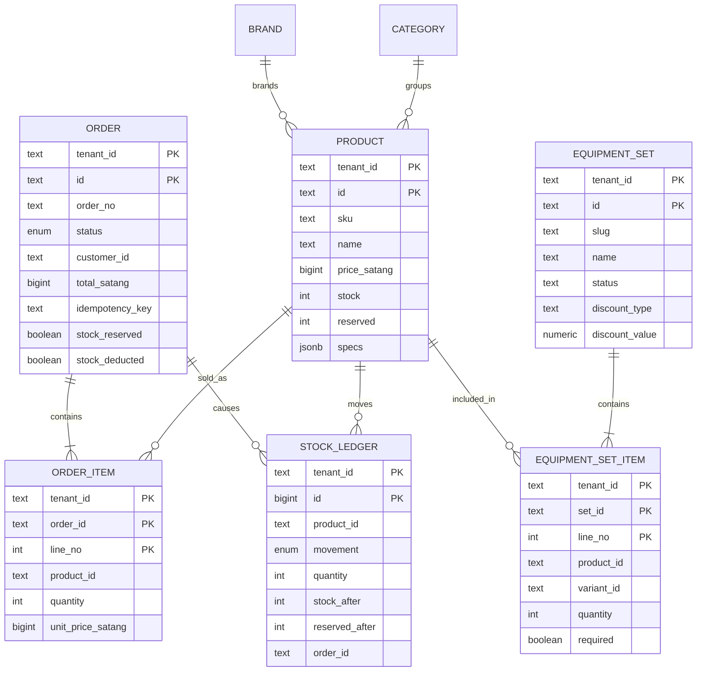

# ERD — Core Relational Data

Stock availability is derived as `stock - reserved`. Money in the transactional order/product tables is stored as integer satang to avoid floating-point reconciliation errors.
