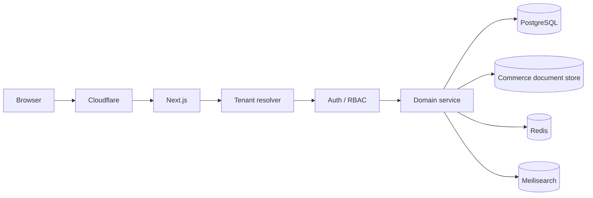
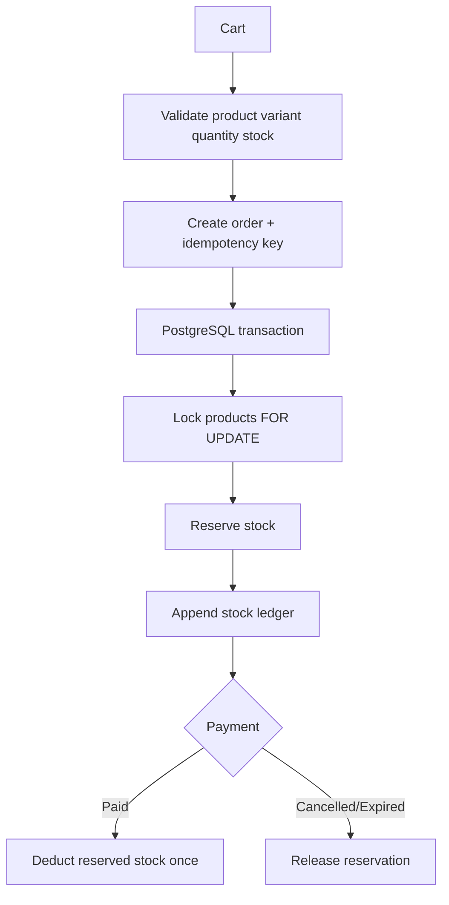
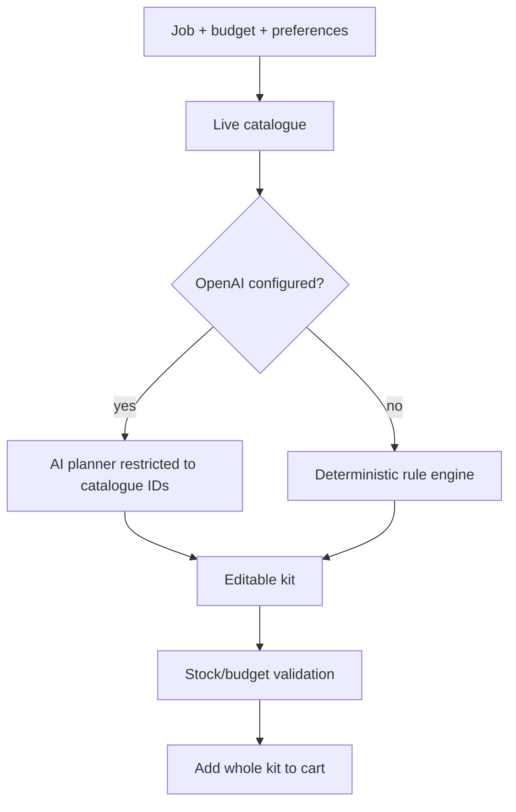

# System Flows

## Request / Tenant

## Checkout / Stock

## Equipment Set Builder

## Background jobs

Next/API pushes jobs to Redis/BullMQ. Workers handle search sync, transactional email, image optimization and maintenance tasks with retries and structured logging.
